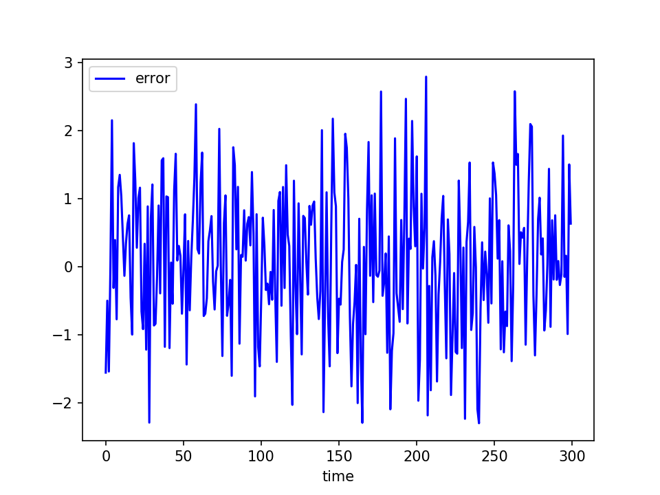
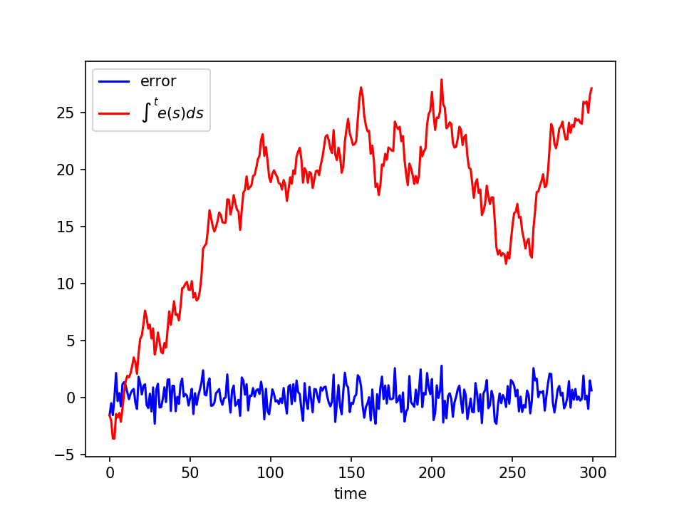
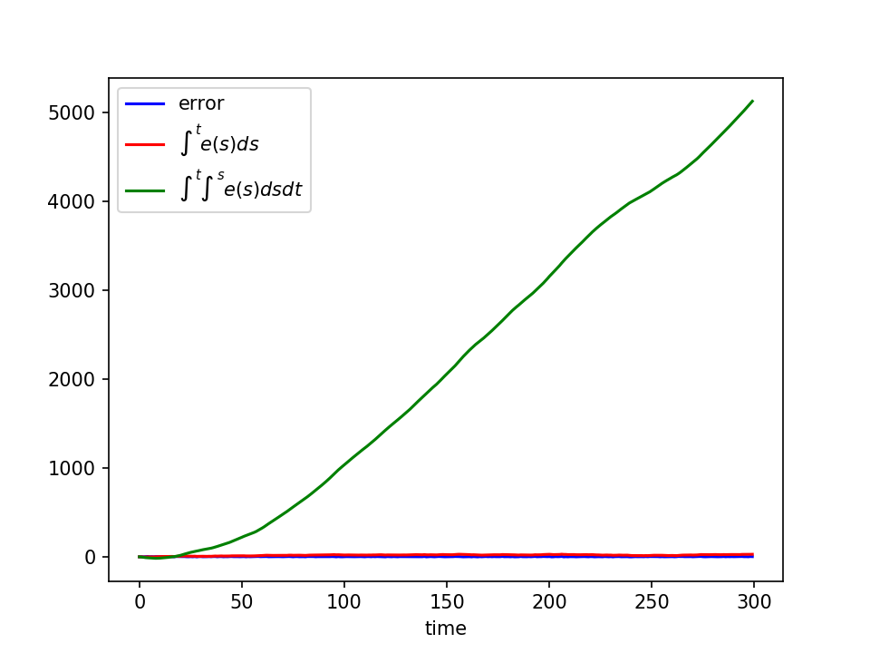

## Contents
- what is the point of this talk?
- what is the challenge?
- what is stater?

---

## What is the point of this talk?
By the end of this talk you should:
  - understand what decides when the device will buzz.
  - understand what can be addressed.
  - understand what can not be addressed.

Important, because you only have one machine learning engineer at the moment.
**Knowing these things will help you help me.**

---

## What is the challenge?
The input looks like this
```json
{"side":{"accelerometer":{"x":-0.9215088,"y":0.010009766,"z":0.019165039},"quaternion":{"w":-0.36803147,"x":0.5970288,"y":-0.347097,"z":-0.6226018},"gyro":{"x":-1.7089844,"y":-0.24414062,"z":0.24414062},"temperature":36,"altitude":-2961,"button":0},"time":1495047945627}
{"side":{"accelerometer":{"x":-0.90405273,"y":-0.1060791,"z":0.033447266},"quaternion":{"w":-0.36077243,"x":0.6014298,"y":-0.33910534,"z":-0.6270031},"gyro":{"x":-1.4038086,"y":0.18310547,"z":0.24414062},"temperature":36,"altitude":-2964,"button":0},"time":1495047945653}
{"side":{"accelerometer":{"x":-0.9477539,"y":-0.20654297,"z":0.08959961},"quaternion":{"w":-0.3563688,"x":0.6040387,"y":-0.3349464,"z":-0.62924516},"gyro":{"x":-0.4272461,"y":0,"z":0.5493164},"temperature":36,"altitude":-2961,"button":0},"time":1495047945693}
{"side":{"accelerometer":{"x":-0.99157715,"y":-0.22045898,"z":0.1048584},"quaternion":{"w":-0.35570565,"x":0.60106194,"y":-0.334771,"z":-0.6325555},"gyro":{"x":0.12207031,"y":-0.61035156,"z":0.91552734},"temperature":36,"altitude":-2956,"button":0},"time":1495047945733}
{"side":{"accelerometer":{"x":-0.94470215,"y":-0.14831543,"z":0.12158203},"quaternion":{"w":-0.35564506,"x":0.5939218,"y":-0.3380673,"z":-0.6375611},"gyro":{"x":0.5493164,"y":-0.79345703,"z":0.9765625},"temperature":36,"altitude":-2953,"button":0},"time":1495047945773}
{"side":{"accelerometer":{"x":-0.8881836,"y":-0.046020508,"z":0.11413574},"quaternion":{"w":-0.35887003,"x":0.5844455,"y":-0.34159788,"z":-0.6426093},"gyro":{"x":0.79345703,"y":-1.0986328,"z":0.36621094},"temperature":36,"altitude":-2956,"button":0},"time":1495047945815}
```
---

Our output looks like this
```json
{"action":"lift.safe","body":{"backAngle":71.04457255759334,"end":1495048190609,"start":1495048188889,"twistAmount":17.977664314273042,"type":"none"}}
{"action":"lift.risky","body":{"backAngle":68.45104241395217,"end":1495048202440,"start":1495048200682,"twistAmount":50.487119749529256,"type":"twist"}}
{"action":"lift.safe","body":{"backAngle":59.843594470741394,"end":1495048203361,"start":1495048202561,"twistAmount":15.918158662410605,"type":"none"}}
```

Basically, we want a triangle to commute. (universe, labels, sensor outputs)

$$
  \require{AMScd}
  \begin{CD}
    Universe @>sensor>> sensor readings \\
    @VlabelVV @VstaterVV \\
    labels @= labels
  \end{CD}
$$

---

### Challenge 1: Sensor readings are many to one

*Example:*
- Universe=(1,2,3,4,5).
- labels are determined by the function (x<4).
- Sensor just tells us if a number is even/odd.

---

### Challenge 1: Sensor readings are many to one

*Relevant example:*
- Universe=(all uses of the device)
- labels = {risky lift, safe lift}
- sensor = offset of the x-axis from gravity.

Lifting your leg behind you produces the same signal as a risky lift.

---
### Challenge 2: Computational power is finite
We have impressive hardware, but it's not magic


 - Too much math drains the battery and we only have 40ms to process each point.
 - Too many log messages drains the battery.

---
#### Impacts

 - Neural nets can't be too deep.
 - Features must be real-time computable.

---
### Challenge 3: Our sensors are not perfect
  - Impact: we must filter.
  - Impact: we can't extract position / velocity from acceleration (draw this)

+++

Imagine the device is sitting flat on a table


$e \sim O(\sigma)$

+++

This is our estimate of the velocity of the device


$drift \propto t \sigma $

+++



$drift \propto O(\sigma^2 t^2)$

---
## Stater
 The input to stater is an i2c data stream.  The stream is fed into plugins:

 - lift (detects risky lifts)
 - kyu (initial calibration)
 - recalibration
 - walk detection

---

### The lift plugin

- The plugin assumes that we know the direction of gravity at the present moment $g_c$ .
  as well as what the gravity would be when you are standing upright $g_r$
  (this is obtained via other plugins).

- We define the angle:
$$\theta := \arccos( g_r \cdot g_c )\, {\rm sign}( g_c \cdot e_y )$$

---
#### window generation
  we wait for $\theta$ to exceed 20 degrees.  Then we wait for it to fall back down.  That defines a window.

---
### window processing
  We extract a bunch of features like:
   ```go
  FEATURE_DURATION              = "duration"
	FEATURE_TIME                  = "time"
	FEATURE_MAX_SAGITTAL          = "maxSag"
	FEATURE_MIN_SAGITTAL          = "minSag"
	FEATURE_FIRST_SAGITTAL        = "firstSag"
	FEATURE_LAST_SAGITTAL         = "lastSag"
	FEATURE_AVG_SAG_VELOCITY      = "sagAvgVelocity"
	FEATURE_PEAK_GRAVITY_Y        = "peakGravY"
	FEATURE_INTQ_GRAV_Z           = "intqGravZ"
	FEATURE_INTQ_GRAV_Y           = "intqGravY"
	FEATURE_RANGE_GRAV_Z          = "rangeGravZ"
	FEATURE_RANGE_GRAV_Y          = "rangeGravY"
	FEATURE_MAX_HEIGHT            = "maxHeight"
	FEATURE_MEAN_SAG              = "meanSag"
	FEATURE_STD_SAG               = "stdSag"
	FEATURE_MIN_HEIGHT            = "minHeight"
	FEATURE_RANGE_HEIGHT          = "rangeHeight"
	FEATURE_TWIST_PLUS            = "twistPlus"
	FEATURE_TWIST_MINUS           = "twistMinus"
	FEATURE_TWIST_MIN             = "twistMin"
	FEATURE_TWIST_MAX             = "twistMax"
	FEATURE_TWIST_RANGE           = "twistRange"
	FEATURE_TWIST_AVG_VELOCITY    = "twistAvgVelocity"
	FEATURE_TWIST_AT_PEAK         = "twistAtPeak"
	FEATURE_TWIST_TIME_TO_MIN     = "twistTimeToMin"
	FEATURE_TWIST_TIME_TO_MAX     = "twistTimeToMax"
	FEATURE_TWIST_BOX_POSITION    = "twistBoxPosition"
	FEATURE_TWIST_PREDICTION      = "twistPrediction"
	FEATURE_TWIST_ROTATION_AMOUNT = "twistRotationAmount"
	FEATURE_NEED_CALIBRATION      = "needCalibration"
	FEATURE_SQUAT_0               = "featuresSquat0"
	FEATURE_SQUAT_1               = "featuresSquat1"
	FEATURE_SQUAT_2               = "featuresSquat2"
	FEATURE_SQUAT_3               = "featuresSquat3"
	FEATURE_SQUAT_4               = "featuresSquat4"
   ```

---

### To buzz or not to buzz
 1. If a squat is predicted, the device will not buzz, and we apply the `squat` label.
 2. If $\theta$ is ridic (i.e. > 75 degrees) we will not buzz, no label is applied.
 3. We estimate the back angle using the sagittal angle via a linear equation.
 4. If the estimated back angle is beyond 72 degrees (corresponds to $\theta = 36$) we label the window as a `bend`.
 5. If the back angle is between 31 and 36, then features are used to predict a twist.
 6. If a twist is detected, we label the window `twist` and the device will buzz.

---

### Initial Calibration (the kyu plugin)
 If the device is put on correctly, then the `kyu` plugin does the work.

 $$s = \sum_{t=1}^N \frac{1}{\sigma_t + \epsilon} g_t$$

 $$g_c = s / |s|$$

---
### Recalibration
 Throughout the day the following is computed

 $$s = \sum_{t=1}^N \max(\Pr(walk)-0.8) g_i$$

 Where $\Pr(walk)$ is determined by the walk plugin.

---

### Walk detection
 Processes on 6 second windows.  Computes the ACF function. then does a vanilla NN on top, every second.

 $$ acf[f] := \sum_k x[k]x[k+i]$$
